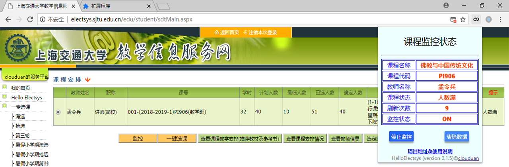

<<<<<<< HEAD
# electsys-loop
=======
# Hello Electsys

### 简介

HelloElectsys 基于扩展 [Electsys++](https://github.com/laohyx/electsys) 二次开发，在原来的基础上去掉一些特性，增加了几个小特性：
 - [x] 一键选课：点击 **选中此老师** 后即可自动完成 **选课提交**，所选即所得,不用选中后再去手动提交
 - [x] 一键退课：点击 **快速退课** 后即可自动完成 **选课提交**，所点即所失,不用退课后再去手动提交
 - [x] 跳过提醒：自动勾选提醒并点击 **继续**，~为您的生命做点微小的贡献 +1s~
 - [x] 监控课程：以5秒一次的频率<s>刷课</s>，如果时间和人数符合则会自动选中并提交。
 - [x] 监控信息：可以实时查看课程的监控信息等
 - [ ] 给课程名设置超链接：由于选课网的点选控件太小，导致不容易点击到，使得交互性体验大大降低，因此将课程名设置超链接，点击课程名即可进入课程安排
 

### 安装

#### 从 Chrome Webstore 安装（推荐）

若有条件绕过防火墙，建议点击进入 [Chrome 商店](https://chrome.google.com/webstore/detail/helloelectsys/nanboebldoojgemepedfpdmdiakffjea?hl=zh-CN&authuser=0) 直接进行安装

#### 从 .crx 文件安装

- 由于 Chrome 安全策略的限制，Windows 下 Chrome 直接从 .crx 文件安装太过折腾，因此不推荐
- Chromium 和 Chrome-dev 浏览器不受此限制，可直接从 .crx 文件安装
- Linux 和 Mac 平台下不受此限制，可以直接通过在 [Release](https://github.com/clouduan/HelloElectsys/releases) 页面下载 .crx 文件进行安装

#### 以开发者模式手动安装

- 在 [Release](https://github.com/clouduan/HelloElectsys/releases) 页面下载，并解压 
- 打开 Chrome， 依次打开 **菜单->更多工具->扩展程序**， 找到右上角的 **开发者模式**，打开
- 点击顶部第二行的 **加载已解压的扩展程序**，选择解压缩得到的文件夹，点击确定

### 使用
- 只兼容 Chrome 和 Chromium 浏览器
- 在进入课程监控状态后，不要继续在同一个浏览器操作选课网站，包括新开一个标签页或窗口去访问选课网！！！如果需要访问选课网，你可以选择用本机其它的浏览器(比如 Edge .etc)或者换台电脑/用手机登录登陆访问
- 在浏览器的扩展栏点击该扩展图标，可以查看课程监控状态,其中包含实时刷新次数和课程信息等
- 如需停止监控，在监控信息页面点击 **停止监控** 按钮
- 低调使用,~闷声大发财~，本人不想承担任何使用后果

### 反馈问题或联系我
- 使用过程中遇到 bug，可以在此处提 [Issue](https://github.com/clouduan/HelloElectsys/issues)
- 目前的[图标](images/logo.png)过于简陋，如果你有更好的图标推荐，欢迎推荐
- 如果你在网页配色/设计方面比较得手，欢迎指点
- 你可以在我的个人主页找到我的联系方式：[点击进入](http://clouduan.github.io)

### 开源协议

本项目来源于 [Electsys++](https://github.com/laohyx/electsys)，遵循 [GPL-v3协议](https://github.com/clouduan/HelloElectsys/blob/master/LICENSE)
>>>>>>> e14b23f... version: 0.1.8
